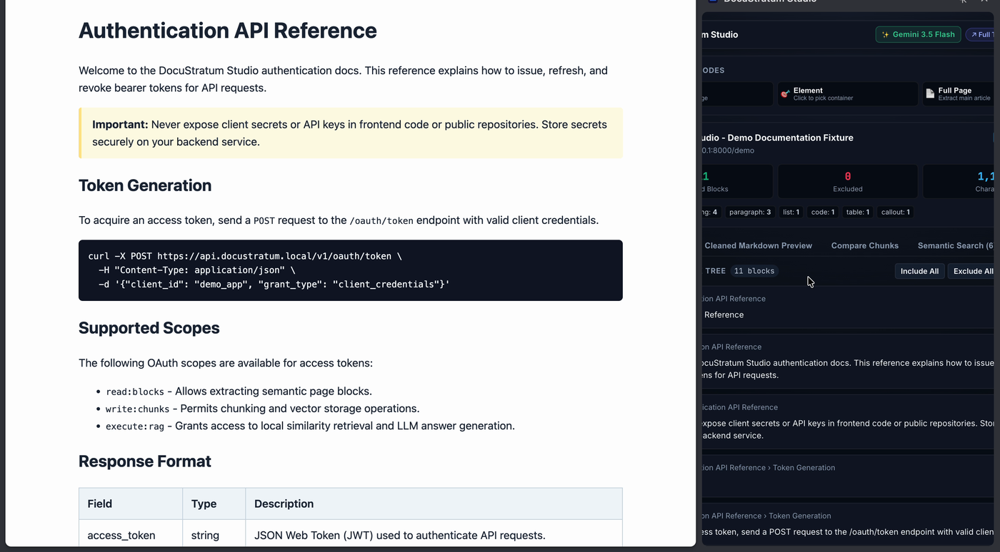
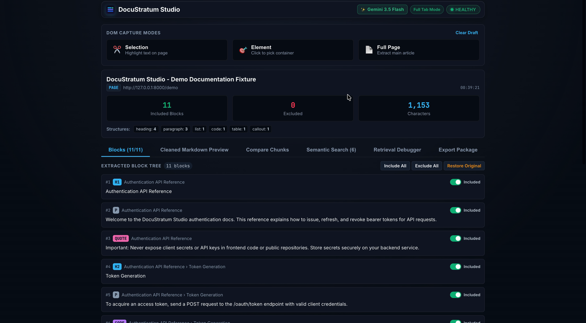
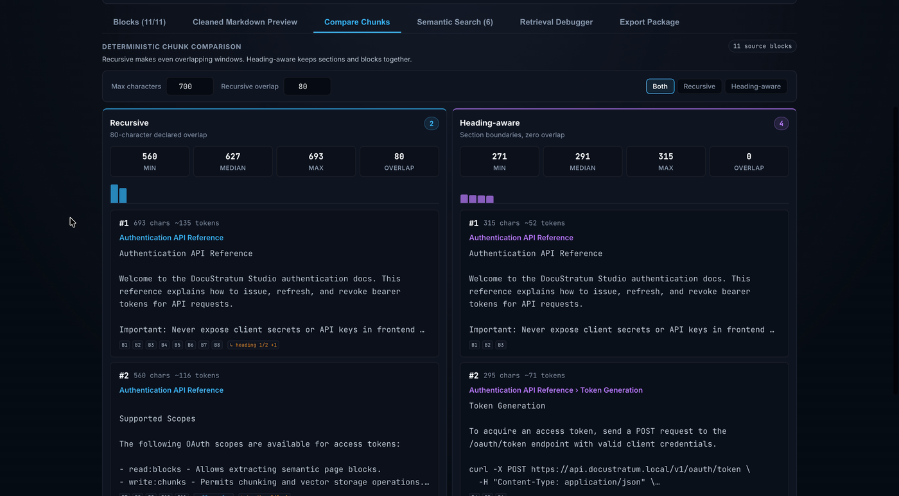
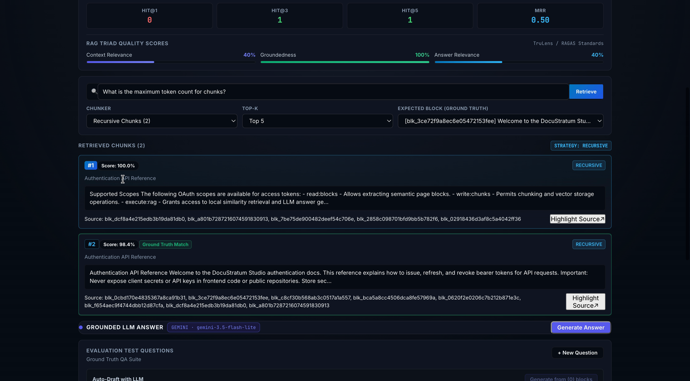

# DocuStratum Studio

<div align="center">

[](README.md)
[](LICENSE)
[](#step-2-build-and-load-the-chrome-extension)
[](#step-1-set-up-and-start-the-companion-service)
[](#step-2-build-and-load-the-chrome-extension)
[](#security--privacy-policy)

**Deterministic Web Content Extraction • Structural Provenance • Parallel Dual-Chunking • 100% Local Vector Retrieval • Grounded LLM Answers**

</div>

---

## Overview

**DocuStratum Studio** is a local-first Chrome extension and companion service engineered to solve the foundational challenge of Retrieval-Augmented Generation (RAG): **unreliable, ungrounded, and leaky web ingestion**.

Traditional web scrapers flatten DOM hierarchy, discard structural context, ingest sensitive authentication fields, and produce brittle vector matches with unprovable citations. DocuStratum Studio replaces heuristic scraping with a deterministic pipeline:

1. **Safe DOM Traversal**: Converts live webpages into structured semantic blocks (`heading`, `paragraph`, `list`, `code`, `table`, `callout`) while strictly omitting scripts, styles, forms, and hidden secrets.
2. **Traceable Provenance**: Every block and chunk retains its source URL, capture timestamp, CSS selector, DOM node path, and cryptographic SHA-256 hash.
3. **Visual Strategy Comparison**: Interactively inspect and compare **Recursive** vs. **Heading-Aware** chunking strategies with token distribution histograms and stable IDs before vectorization.
4. **100% On-Device Neural Retrieval**: Generates 384-dimensional embeddings and ranks candidates in-memory using `all-MiniLM-L6-v2` (~15ms latency). Zero webpage text leaves your machine.
5. **Grounded Generation & 1-Click DOM Jump**: Optional Groq Llama 3.3 70B integration streams answers with verified citation badges. Clicking any citation instantly scrolls to and highlights the exact live DOM source node.
6. **Self-Contained Portable Packages**: Export auditable `.zip` packages containing Markdown, JSONL blocks, chunk mappings, evaluation records, and a zero-dependency Python loader.

## Product Walkthrough

<div align="center">

| **1. One-Click Live DOM Capture & Safety** | **2. Full Tab Studio & Block Tree Review** |
| :---: | :---: |
|  |  |
| *Deterministic block extraction stripping out sensitive forms* | *Interactive inclusion toggles and structural block tree* |

| **3. Recursive vs. Heading-Aware Chunking** | **4. Retrieval Debugger & RAG Triad** |
| :---: | :---: |
|  |  |
| *Side-by-side chunk metrics, token counts, and histograms* | *Hit@K, MRR, and TruLens/RAGAS Triad evaluation meters* |

</div>

---

## Architecture

```text
┌─────────────────────────────────────────────────────────────────────────────┐
│                          GOOGLE CHROME (ACTIVE TAB)                         │
│  ┌─────────────────────────────────┐   ┌─────────────────────────────────┐  │
│  │     Target Web Document         │   │   Injected Content Script       │  │
│  │  • Main Article / Selection     │──▶│   • Visual Element Picker       │  │
│  │  • Excluded Form / Passwords    │   │   • DOM Node Sanitizer          │  │
│  │  • Live Source DOM Highlighting │◀──│   • TreeWalker & TextQuote Anchors││
│  └─────────────────────────────────┘   └─────────────────┬───────────────┘  │
│                                                          │                  │
│  ┌───────────────────────────────────────────────────────▼───────────────┐  │
│  │               DocuStratum Studio Side Panel (React 18 + Vite)         │  │
│  │  • Block Review & Inclusion Toggles  • Cleaned Markdown Preview       │  │
│  │  • Parallel Chunker Visualizer       • Retrieval Debugger (Hit@K, MRR)│  │
│  │  • Grounded Answer Streaming Panel   • Portable Package Exporter      │  │
│  └───────────────────────────────────────────────┬───────────────────────┘  │
└──────────────────────────────────────────────────┼──────────────────────────┘
                                                   │ HTTP / REST (JSON)
                                                   ▼
┌─────────────────────────────────────────────────────────────────────────────┐
│                 LOCAL FASTAPI COMPANION SERVICE (127.0.0.1:8000)            │
│  ┌────────────────────────────────┐   ┌──────────────────────────────────┐  │
│  │  Embeddings Engine (PyTorch)   │   │  Vector Search & Reranking       │  │
│  │  • all-MiniLM-L6-v2 (384d)     │   │  • Cosine Similarity (NumPy)     │  │
│  │  • CPU / Apple Silicon (MPS)   │   │  • Deterministic Tie-Breaking    │  │
│  │  • SHA-256 Embedding LRU Cache │   │  • BM25 Hybrid Fusion Option     │  │
│  └────────────────────────────────┘   └──────────────────────────────────┘  │
│  ┌────────────────────────────────┐   ┌──────────────────────────────────┐  │
│  │  Packager & Checksum Validator │   │  Grounded LLM Gateway (Optional) │  │
│  │  • SHA-256 Manifest Generator  │   │  • Groq Provider (Llama 3.3 70B) │  │
│  │  • Referential Integrity Check │   │  • Anti-Hallucination Guardrails │  │
│  │  • Zero-Dependency Zip Loader  │   │  • Strict Citation Enforcement   │  │
│  └────────────────────────────────┘   └──────────────────────────────────┘  │
└─────────────────────────────────────────────────────────────────────────────┘
```

---

## Core Capabilities

| Capability | DocuStratum Studio Implementation | Traditional Web Scrapers / RAG |
| :--- | :--- | :--- |
| **Extraction Model** | Deterministic semantic block normalizer preserving tables, code, and heading hierarchy | Lossy regex or markdown conversion that flattens headings and destroys table schemas |
| **Privacy & Sanitization** | Automatic boundary exclusion for password inputs, tokens, forms, scripts, and hidden tags | Often dumps raw HTML forms, auth inputs, and session tokens into embeddings |
| **Provenance Tracking** | Cryptographic content hash + CSS selector + node path + contextual text quote | Abstract URL link without locator or sentence-level provenance |
| **Chunking Transparency** | Side-by-side visual comparison of Recursive vs. Heading-Aware splitters | Black-box server-side splitter with hidden overlaps and dropped chunks |
| **Vector Retrieval** | In-memory normalized cosine similarity running 100% locally on CPU/MPS | Third-party vector database with network latency and remote text storage |
| **Citation Verification** | Strict citation filter: rejects answers referencing non-retrieved chunks | Common hallucination where models fabricate citation numbers and URLs |
| **Packaging & Portability** | Standalone `.zip` with SHA-256 manifest, JSONL data, and pure-Python loader | Proprietary cloud vector index format requiring vendor lock-in |

---

## Project Monorepo Structure

```text
DocuStratum/
├── extension/                         # Chrome Manifest V3 Extension
│   ├── src/
│   │   ├── background/                # MV3 background worker & message router
│   │   ├── capture/                   # DOM traversal, element picker & sanitizers
│   │   ├── chunking/                  # Recursive & heading-aware deterministic chunkers
│   │   ├── content/                   # Content script, DOM interaction & highlighter
│   │   ├── retrieval/                 # Local FastAPI service REST client
│   │   └── sidepanel/                 # Side panel React application & UI components
│   ├── manifest.json                  # Extension manifest configuration
│   └── package.json                   # Extension build and Vitest scripts
├── service/                           # Local FastAPI Companion Service
│   ├── embeddings.py                  # EmbeddingEngine singleton & vector search
│   ├── main.py                        # REST API routes (/health, /embed, /search, etc.)
│   ├── models.py                      # Pydantic schemas and contract validation
│   ├── llm/                           # Provider abstraction, Groq adapter & citations
│   ├── packager/                      # Manifest hasher, ZIP exporter, and Python loader
│   ├── examples/                      # Downstream loader & Chroma import examples
│   └── tests/                         # Comprehensive pytest test suite
├── packages/schema/                   # Shared TypeScript definitions & JSON schemas
├── fixtures/                          # Local HTML fixtures (demo, adversarial, golden)
├── docs/                              # Technical specifications & component runbooks
│   ├── safe-dom-capture.md            # DOM extraction & provenance engine
│   ├── deterministic-chunking.md      # Chunking strategies & comparison
│   ├── local-embeddings-retrieval.md  # Embedding engine & vector search mathematics
│   ├── visual-retrieval-debugger.md   # Debugger, metrics (Hit@K, MRR) & DOM highlighter
│   ├── grounded-llm-answers.md        # LLM gateway, streaming & citation validation
│   ├── portable-rag-package.md        # Archive layout, manifest hashing & loader
│   ├── reliability-security-polish.md # Security boundaries, limits & benchmark records
│   └── release-candidate.md           # Verification runbook & release criteria
├── production-specification.md        # Master System Architecture & Production Spec
└── scripts/
    ├── check-all.sh                   # Unified quality gate (Python + TS + Build)
    ├── smoke-golden-path.sh           # 3x Golden path integration test runner
    ├── benchmark-retrieval.py         # On-device latency benchmark script
    └── validate-package.py            # CLI ZIP package integrity validator
```

---

## Quickstart Guide

### Prerequisites
* **Node.js**: `^20.19.0` or `>=22.12.0` (with `npm`)
* **Python**: `3.10` or later
* **Google Chrome**: Version 116+ (supporting Chrome Side Panel API)

---

### Step 1: Set Up and Start the Companion Service

1. Clone the repository and enter the directory:
   ```bash
   cd WebRAG
   ```

2. Create and activate a Python virtual environment:
   ```bash
   python3 -m venv .venv
   source .venv/bin/activate
   ```

3. Install companion service dependencies:
   ```bash
   pip install -r service/requirements-dev.txt
   ```

4. *(Optional)* Configure Groq for grounded answer generation:
   ```bash
   export GROQ_API_KEY="gsk_your_api_key_here"
   ```
   > **Privacy Note**: The API key is stored strictly in your local shell session. It is never transmitted to the browser extension, stored in local storage, logged, or exported into packages.

5. Launch the companion service:
   ```bash
   uvicorn service.main:app --host 127.0.0.1 --port 8000 --reload
   ```

6. Verify service health in a separate terminal:
   ```bash
   curl http://127.0.0.1:8000/health
   # Returns: {"status":"healthy","version":"0.1.0","schemaVersion":"1.0.0",...}
   ```

---

### Step 2: Build and Load the Chrome Extension

1. Install extension dependencies:
   ```bash
   cd extension
   npm install
   ```

2. Build the production extension bundle:
   ```bash
   npm run build
   ```

3. Load into Google Chrome:
   * Navigate to `chrome://extensions`.
   * Enable **Developer mode** (toggle in the top-right corner).
   * Click **Load unpacked** and select the `DocuStratum/extension/dist` directory.
   * Pin **DocuStratum Studio** to your Chrome toolbar.
   * Click the extension icon to open the Side Panel.

---

### Step 3: Run the Golden Path on the Demo Fixture

1. Open the included demo documentation page in Chrome:
   ```text
   file:///path/to/DocuStratum/fixtures/demo-fixture.html
   ```
2. Click the **DocuStratum Studio** side panel icon.
3. Click **Capture Page** or **Capture Element** to extract semantic blocks and start querying!

---

## Running Tests & Quality Checks

DocuStratum Studio enforces a zero-defect policy with comprehensive test suites spanning both Python and TypeScript:

### Unified Quality Gate (One Command)
Run all backend tests, frontend tests, and the production extension build:
```bash
bash scripts/check-all.sh
```

### Individual Test Suites
```bash
# Python service tests (44 passed)
PYTHONPATH=. .venv/bin/pytest service/tests -v

# Extension unit & component tests (71 passed)
cd extension && npm test

# Focused chunking algorithms test suite
cd extension && npm run test:chunking

# Focused local retrieval test suite
cd extension && npm run test:retrieval

# 3x Golden path integration smoke test
npm run smoke

# On-device retrieval latency benchmark
npm run benchmark:retrieval
```

---

## REST API Reference

The FastAPI service exposes high-performance local endpoints restricted to loopback and extension origins:

| Endpoint | Method | Description |
| :--- | :--- | :--- |
| `/health` | `GET` | Service liveness probe, version, and schema compatibility |
| `/version` | `GET` | Supported capture modes and chunking strategies |
| `/model/status` | `GET` | Embedding model status, device (`mps`/`cpu`), dimension (`384`), and cache stats |
| `/embed` | `POST` | Generate normalized embeddings for chunks or raw text strings |
| `/search` | `POST` | Execute local cosine similarity search across candidate chunks |
| `/retrieval/query` | `POST` | Run measured retrieval debugger query with performance timing |
| `/evaluation/draft-questions` | `POST` | Generate candidate test questions from selected semantic blocks |
| `/llm/status` | `GET` | Report optional LLM provider readiness without exposing credentials |
| `/llm/answer` | `POST` | Generate a citation-validated grounded answer |
| `/llm/answer/stream` | `POST` | Server-Sent Events (SSE) streaming answer generation with recoverable error events |
| `/export/package` | `POST` | Construct a validated portable RAG ZIP archive |
| `/package/validate` | `POST` | Verify archive checksums, schemas, and referential integrity |

---

## Portable Package Format

Exported RAG packages are standard, self-contained ZIP archives containing structured human-readable and machine-parseable artifacts:

```text
docustratum-package.zip
├── manifest.json              # SHA-256 hashes, source identity & model metadata
├── README.md                  # Documentation and quickstart code snippets
├── source/
│   ├── cleaned.md             # Continuous cleaned Markdown document
│   └── blocks.jsonl           # Ordered semantic DOM blocks with source anchors
├── chunks/
│   └── chunks.jsonl           # Strategy-partitioned chunks with block relationships
└── evaluation/
    ├── questions.jsonl        # Evaluation questions & expected block labels
    ├── retrieval-results.jsonl# Measured latency, ranks & scores
    └── answers.jsonl          # Grounded answers with verified citation links
```

### Inspect Packages with the Zero-Dependency Python Loader
```python
from service.packager.loader import RAGPackage

# Open and validate archive in memory
pkg = RAGPackage.open("docustratum-sample.zip")
print(f"Valid: {pkg.validate().valid}")
print(f"Source URL: {pkg.manifest.sourceIdentity.url}")

# Iterate over chunks and resolve source blocks
for chunk in pkg.chunks:
    print(f"[{chunk.strategy}] {chunk.id}: {chunk.content[:60]}...")
    for block in chunk.resolve_blocks(pkg):
        print(f"  └─ Source Anchor: {block.sourceAnchor.cssSelector}")
```

Validate package archives via CLI:
```bash
python3 scripts/validate-package.py path/to/docustratum-package.zip
```

---

## Performance Benchmarks

Local retrieval benchmarks measured on Apple Silicon (M-series, CPU device) using `all-MiniLM-L6-v2`:

| Metric | Result | Notes |
| :--- | :--- | :--- |
| **Model Initialization (Cold)** | ~4.1s | One-time lazy weight load from local cache |
| **Warm Retrieval Median Latency** | **4.57 ms** | 20 uncached queries against document chunks |
| **Warm Retrieval P95 Latency** | **6.52 ms** | Normal distribution across search candidates |
| **Embedding Cache Hit Latency** | **< 0.2 ms** | Instant hash-indexed lookup for unchanged chunks |
| **Extension Build Duration** | **~85 ms** | Vite 8 + TypeScript compilation |

---

## Security & Privacy Policy

* **100% Local Processing**: Content normalization, chunking, embedding generation, vector search, and evaluation metrics execute entirely on your machine.
* **Sensitive Element Exclusion**: Password inputs, hidden fields, authorization tokens, scripts, styles, and form values are discarded at DOM traversal time.
* **Least-Privilege Extension**: Page scripts are injected only upon user interaction via `activeTab` and `scripting`. No persistent all-sites monitoring.
* **Credential Isolation**: LLM API keys exist exclusively within the local FastAPI environment and are never accessible to the Chrome extension, browser storage, or exported packages.
* **Safe Log Boundaries**: Service logs record request IDs, status codes, and execution durations. Webpage text, user queries, and prompts are never written to disk logs.
* **Bounded Resource Caps**: API requests are capped at 5 MB, with explicit ceilings of 1,000 blocks, 2,000 chunks, and 50 LLM context chunks to prevent resource exhaustion.

---

## Technical Specifications & Deep Dives

For detailed engineering decision records, mathematical foundations, and component specifications, consult the runbooks in `docs/`:

* [Safe DOM Capture & Provenance Engine](docs/safe-dom-capture.md)
* [Deterministic Chunking & Strategy Comparison](docs/deterministic-chunking.md)
* [Local Embeddings & In-Memory Vector Retrieval](docs/local-embeddings-retrieval.md)
* [Visual Retrieval Debugger & DOM Provenance](docs/visual-retrieval-debugger.md)
* [Grounded LLM Answers & Provider Resilience](docs/grounded-llm-answers.md)
* [Portable RAG Package System & Python Loader](docs/portable-rag-package.md)
* [Reliability, Security Hardening & Benchmarks](docs/reliability-security-polish.md)

---

## Troubleshooting

* **Header shows `OFFLINE`**: Ensure the FastAPI service is running on `127.0.0.1:8000`. Click the status badge to retry the health check.
* **Capture cannot start**: Chrome restricts extensions on internal pages (`chrome://`, Chrome Web Store). Open an ordinary `http`, `https`, or local file URL.
* **First-run download**: The first time the embedding engine runs, it downloads `all-MiniLM-L6-v2` (~80MB). Once cached locally, retrieval works completely offline.
* **Groq actions disabled**: If `GROQ_API_KEY` is not set in the service environment, grounded answers are gracefully disabled while all deterministic ingestion, chunking, search, highlighting, and packaging features remain 100% functional.

---

## License

This project is licensed under the [MIT License](LICENSE).
