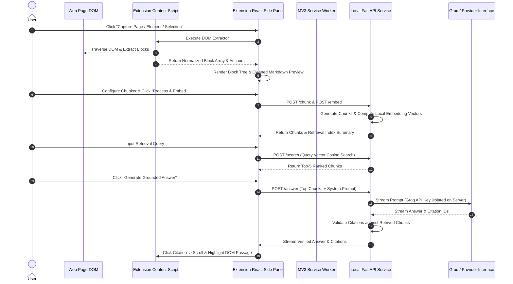

# WebRAG Studio Data Flow Diagram

```mermaid
sequenceDiagram
    autonumber
    actor User
    participant WebPage as Web Page DOM
    participant ContentScript as Extension Content Script
    participant SidePanel as Extension React Side Panel
    participant Worker as MV3 Service Worker
    participant Backend as Local FastAPI Service
    participant LLM as Groq / Provider Interface

    User->>SidePanel: Click "Capture Page / Element / Selection"
    SidePanel->>ContentScript: Execute DOM Extractor
    ContentScript->>WebPage: Traverse DOM & Extract Blocks
    ContentScript-->>SidePanel: Return Normalized Block Array & Anchors
    SidePanel->>SidePanel: Render Block Tree & Cleaned Markdown Preview
    User->>SidePanel: Configure Chunker & Click "Process & Embed"
    SidePanel->>Backend: POST /chunk & POST /embed
    Backend->>Backend: Generate Chunks & Compute Local Embedding Vectors
    Backend-->>SidePanel: Return Chunks & Retrieval Index Summary
    User->>SidePanel: Input Retrieval Query
    SidePanel->>Backend: POST /search (Query Vector Cosine Search)
    Backend-->>SidePanel: Return Top-5 Ranked Chunks
    User->>SidePanel: Click "Generate Grounded Answer"
    SidePanel->>Backend: POST /answer (Top Chunks + System Prompt)
    Backend->>LLM: Stream Prompt (Groq API Key isolated on Server)
    LLM-->>Backend: Stream Answer & Citation IDs
    Backend->>Backend: Validate Citations against Retrived Chunks
    Backend-->>SidePanel: Stream Verified Answer & Citations
    SidePanel->>ContentScript: Click Citation -> Scroll & Highlight DOM Passage
```
