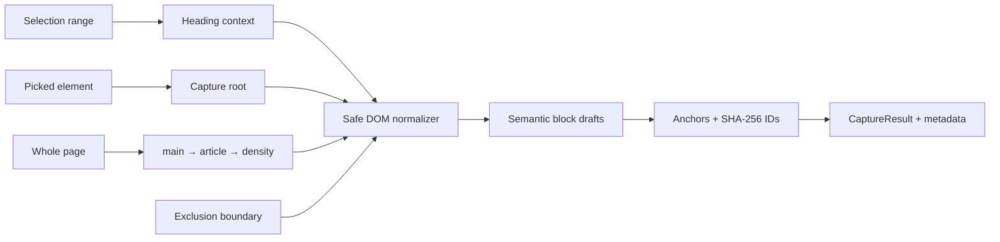

# Day 2 — Safe DOM capture and provenance

## Outcome and invariants

Day 2 produces a `CaptureResult` containing capture metadata and an ordered list of normalized semantic blocks. Selection, element, and page modes all converge on the same normalizer, exclusion boundary, hash function, and anchor format.

The implementation keeps these invariants:

- Page content is treated as untrusted input. Extraction never executes page code or reads form-control values.
- A block contains only normalized semantics; it never retains live DOM nodes or raw HTML.
- An unchanged source URL and DOM produce byte-equivalent normalized blocks, block IDs, block hashes, and a capture content hash. The capture timestamp is intentionally new for every event.
- Each block has four ways to relocate its source later: stable block ID, heading path, text quote with context, and CSS selector/node path fallback.
- All capture modes use exactly the same content exclusion and block conversion rules.



## Step-by-step implementation roadmap

### 1. Extend the shared contract

**Build:** Add `TextQuote`, `BlockAttributes`, the expanded `SourceAnchor`, and `CaptureResult` to the TypeScript, JSON Schema, and Pydantic contracts.

**Why:** The extraction layer and later service/UI layers need one serializable boundary. Structural data such as table cells must not be reconstructed from display Markdown in Day 3 or Day 4.

**Connection:** Every subsequent step returns this contract; Day 3 can persist and review it without depending on browser DOM APIs.

### 2. Establish the safe text boundary

**Build:** Centralize visibility, editability, sensitive-control, navigation, and repeated-UI checks. Make all text traversal pass through `safeText`/`safeNormalizedText`.

**Why:** Filtering after extracting `textContent` is too late: password-adjacent labels, populated controls, hidden content, or scripts may already have entered a block or hash.

**Connection:** Normalization, density scoring, and text-quote generation share the same safe view of the page, so metadata cannot accidentally reintroduce excluded text.

### 3. Normalize the DOM into semantic blocks

**Build:** Traverse in document order and emit heading, paragraph, list, code, table, and callout drafts. Stop descending once a semantic element is emitted to prevent duplicates.

**Why:** RAG quality and review usability depend on structural boundaries. A single page-wide text blob loses heading scope, table meaning, and code formatting.

**Connection:** Heading state is carried through traversal and copied into each block; structural attributes are available to later Markdown and chunking code.

### 4. Generate deterministic provenance

**Build:** Hash a canonical serialization of block semantics with SHA-256. Derive a block ID from source URL, semantic hash, and deterministic duplicate occurrence. Generate a unique CSS selector, node path, heading path, and contextual text quote.

**Why:** DOM selectors alone are brittle, text quotes alone can be ambiguous, and random IDs defeat recapture comparison.

**Connection:** Day 6 source highlighting can try the selector/path first, verify against the quote, and fall back to quote + heading path when the live DOM has changed.

### 5. Implement page capture

**Build:** Prefer a sufficiently substantial visible `main`/`[role=main]`, then `article`, then rank `body`, `section`, and `div` candidates using safe text length, link density, structural density, semantic-node bonus, and control penalties.

**Why:** Semantic landmarks are the strongest low-cost signal. Density is needed for older or generic layouts without landmarks.

**Connection:** The chosen root flows through the common normalizer and metadata builder.

### 6. Implement selection capture

**Build:** Validate the live `Selection`, find intersecting semantic owners, preserve partial prose/code text, and prepend at most two preceding hierarchy headings.

**Why:** Capturing an entire paragraph for a short selection violates user intent, while omitting its section makes the fragment hard to retrieve and understand.

**Connection:** Context headings are ordinary traceable blocks; selected content uses the same IDs, hashes, and exclusion rules as other modes.

### 7. Implement element capture and picker lifecycle

**Build:** Resolve inline clicks to their nearest semantic owner, capture containers as containers, and implement an event-capturing picker with hover outline, click interception, Escape cancellation, and unconditional cleanup.

**Why:** A picker must not activate links or buttons during selection, and it must leave no styles/listeners behind. Resolving an inline `<strong>` to its paragraph avoids confusing empty captures.

**Connection:** The content script emits the completed `CaptureResult` to the extension runtime; the service worker remains stateless as required by MV3.

### 8. Record capture metadata

**Build:** Record fragment-free URL, safely resolved HTTP(S) canonical URL, title, ISO capture time, mode, extractor version, and an aggregate content hash. Use the aggregate hash for a deterministic capture ID.

**Why:** These fields make exports reproducible and allow later recapture/change comparisons. Ignoring malformed or non-HTTP canonical links prevents untrusted metadata from becoming a source identity.

**Connection:** Day 3 stores this record; Day 4 keys chunks by capture/block identity; export records the extractor version and capture hash.

### 9. Prove the acceptance gates

**Build:** Use a local HTML fixture and checked-in golden semantic projection. Test every supported block, exclusions, all three modes, picker cleanup, page-root fallbacks, metadata, anchors, and repeatability.

**Why:** Browser extraction regressions are subtle and often caused by harmless-looking traversal changes. A golden projection makes semantic changes explicit in review.

**Connection:** The same fixture remains useful for Day 3 rendering, Day 4 chunk boundaries, and Day 6 highlighting.

## Complete Day 2 file structure

```text
WebRAG/
├── packages/schema/
│   ├── index.ts                         # Shared CaptureResult/Block/anchor types
│   ├── block.json                       # JSON Schema for enriched semantic blocks
│   ├── capture.json                     # Capture metadata schema
│   └── capture-result.json              # Envelope linking metadata and blocks
├── service/
│   ├── models.py                        # Matching Pydantic boundary models
│   └── tests/test_capture_contract.py   # Cross-runtime contract validation
├── extension/
│   ├── package.json                     # Vitest/jsdom test dependencies and command
│   ├── package-lock.json                # Reproducible dependency resolution
│   ├── tsconfig.json                    # Browser + test type environments
│   ├── vitest.config.ts                 # DOM test environment and setup
│   └── src/
│       ├── content/index.ts             # Runtime capture message adapter
│       └── capture/
│           ├── index.ts                 # Public capture API
│           ├── types.ts                 # Browser-side serializable contracts
│           ├── constants.ts             # Extractor version/selectors/limits
│           ├── hash.ts                  # SHA-256 and stable serialization
│           ├── dom-safety.ts            # Exclusion and safe text traversal
│           ├── headings.ts              # Preceding heading stack recovery
│           ├── anchors.ts               # Selector/path/contextual text quote
│           ├── normalize.ts             # DOM-to-block conversion
│           ├── metadata.ts              # Page identity and capture metadata
│           ├── selection.ts             # Range capture + heading context
│           ├── element.ts               # Element capture + picker lifecycle
│           ├── page.ts                  # Landmark and density page capture
│           └── __tests__/
│               ├── setup.ts             # Web Crypto setup for jsdom
│               ├── capture.test.ts       # Complete Day 2 acceptance suite
│               ├── capture.live.test.ts  # Opt-in MDN validation using live HTML
│               └── fixtures/
│                   ├── golden-page.html  # Supported + hostile edge cases
│                   └── golden-page.blocks.json # Expected semantic projection
├── docs/
│   └── day-2-safe-dom-capture.md         # This implementation/runbook
├── scripts/
│   └── check-all.sh                      # Service, capture tests, extension build
└── package.json                          # Root test:capture command
```

## Component API and behavior

The complete implementation is in `extension/src/capture`. Its public API is:

```ts
captureSelection(selection, environment): Promise<CaptureResult>
captureElement(element, environment): Promise<CaptureResult>
capturePage(environment): Promise<CaptureResult>
new ElementPicker(environment, callbacks).start(): void
normalizeDom(root, options): Promise<Block[]>
```

The content script accepts these messages:

| Request action | Response/event |
|---|---|
| `CAPTURE_SELECTION` | Direct `{ ok, result }` response |
| `CAPTURE_PAGE` | Direct `{ ok, result }` response |
| `START_ELEMENT_PICKER` | `{ ok, status: "armed" }`, then `WEBRAG_CAPTURE_COMPLETE` |
| `CANCEL_ELEMENT_PICKER` | `{ ok, status: "cancelled" }` |

Picker cancellation emits `WEBRAG_PICKER_CANCELLED`; capture failures emit `WEBRAG_CAPTURE_ERROR`. Day 3 should validate `ok` and discard any previous capture before displaying an error, avoiding stale-state confusion.

### Normalized block representation

- **Heading:** normalized text plus `headingLevel`; its `headingPath` includes itself.
- **Paragraph:** visible, safe inline text with whitespace collapsed.
- **List:** deterministic Markdown including nested ordered/unordered indentation plus `listKind`.
- **Code:** newline-preserving, dedented content plus normalized `codeLanguage` from `data-language`, `lang-*`, `language-*`, or `highlight-source-*`.
- **Table:** deterministic Markdown plus explicit `tableHeaders` and `tableRows`. A headerless table receives stable `Column N` headers.
- **Callout:** safe text plus `calloutKind` for quotes, ARIA alerts/notes/status, and common admonition classes.

### Exclusion rules

The exclusion boundary rejects the element and its entire subtree when it finds:

- `script`, `style`, `noscript`, `template`, embedded documents/media execution surfaces, SVG/canvas;
- `nav`, `footer`, navigation/menu/search/toolbar/tab roles, and common repeated-UI markers;
- `form`, `input`, `textarea`, `select`, `option`, `button`, labels, fieldsets, and outputs;
- password and hidden inputs (already covered by the control boundary);
- any active `contenteditable` ancestor;
- `hidden`, `inert`, `aria-hidden=true`, computed `display:none`, hidden/collapsed visibility, or zero opacity;
- any subtree explicitly marked `data-webrag-exclude`.

Avoid adding broad selectors such as every `aside`, `header`, or class containing `sidebar`: documentation callouts and useful table-of-contents context often use them. Add new repeated-UI exclusions only with fixture coverage.

## Learning outcomes and design rationale

| Concept | Problem solved | How it works / why chosen | Common pitfalls |
|---|---|---|---|
| Safe recursive text view | Raw `textContent` leaks excluded descendant text | Every consumer uses one recursive filter before concatenation | Filtering only final strings cannot reliably identify leaked values |
| Semantic single-pass traversal | Nested semantic nodes otherwise duplicate text | Emit a recognized block and stop descending; containers recurse | Calling `textContent` on callouts/tables bypasses hidden-child rules |
| Heading stack | Flat blocks lose section meaning | H1–H6 updates truncate deeper levels and preserve valid ancestors | Assuming heading levels never skip; sparse levels must be filtered |
| Structured attributes + Markdown | Display text alone loses table/list/code semantics | Keep deterministic Markdown and typed attributes | Parsing Markdown back into rows during chunking is lossy and unnecessary |
| Canonical stable serialization | Object key order or timestamps can destabilize hashes | Recursively sort keys; hash semantics only with SHA-256 | Including capture time, transient picker attributes, or raw HTML breaks idempotency |
| Composite source anchors | Any one anchor can fail after a page update | Store a semantic ID, hierarchy, source-text quote context, selector, and node path | Display Markdown is not a valid source quote for lists/tables; quote the safe source text instead |
| Landmark + density root selection | Pages vary widely in structure | Prefer author-declared semantics, then score visible candidates | Always choosing `body` captures chrome; always choosing the longest `div` captures wrappers |
| Selection semantic ownership | DOM ranges often start inside text or inline markup | Map intersections to semantic owners and override prose/code with selected text | `Range.cloneContents()` loses the original-node identity needed for anchors |
| Capturing-phase picker events | Clicks might navigate or trigger page handlers | Intercept before page handlers, prevent default, stop immediate propagation | Forgetting cleanup on success, Escape, replacement, or an exception leaves the page altered |
| Web Crypto SHA-256 | Portable deterministic identity is needed in Chrome | Native async SHA-256 avoids dependencies and weak hashes | Using JS string hashes creates collision risk and inconsistent Unicode behavior |

## Test strategy and fixtures

Run the Day 2 gate:

```bash
npm run test:capture
npm run build:extension
```

Run the whole repository gate:

```bash
npm test
```

Run the opt-in real-page gate (requires internet and is excluded from deterministic CI):

```bash
npm run test:capture:live
```

The golden fixture covers:

- H1/H2/H3 hierarchy, paragraphs, inline formatting;
- nested unordered/ordered lists;
- fenced-code content and a TypeScript language hint;
- warning and quote callouts;
- headered and headerless tables, including an escaped pipe;
- scripts/styles, navigation/footer, a populated form, password input, button text, editable content, explicit exclusions, and four hidden-node mechanisms.

The suite maps directly to the acceptance gate:

| Gate | Test |
|---|---|
| Every supported block renders correctly | Golden semantic projection equality |
| Sensitive/control content excluded | Named sentinel strings absent from the entire serialized result |
| Idempotent blocks and IDs | Two captures deep-equal; capture/block hashes and IDs match |
| Selection capture | Partial inline selection plus H1 context |
| Element capture | Reference section with hierarchy and structured descendants |
| Page capture | Full golden page and root fallback tests |
| Picker behavior | Hover marker, click interception, success cleanup, Escape cleanup |
| Metadata/provenance | Exact metadata and every anchor/hash field asserted |

Default tests deliberately avoid the network. The opt-in live test fetches the current MDN HTML and runs the exact page, selection, and element modules against it. It is not part of CI because public-site tests can fail due to redesigns, bot defenses, localization, or connectivity.

### Public documentation validation

Use MDN's [SubtleCrypto.digest documentation](https://developer.mozilla.org/en-US/docs/Web/API/SubtleCrypto/digest) as the Day 2 real-world target. It contains a semantic main region, heading hierarchy, prose, lists, code examples, and tables.

1. Run `npm run build:extension` and load `extension/dist` as an unpacked extension.
2. Open the MDN target and open the WebRAG side panel/background inspection console.
3. Send `CAPTURE_PAGE`. Confirm the root excludes MDN navigation/footer and returns headings, paragraphs, code, lists, and tables.
4. Select one sentence beneath **Syntax** and send `CAPTURE_SELECTION`. Confirm the exact selection plus no more than two context headings.
5. Start the picker and click a code-example container. Confirm hover outline, prevented page action, element-mode result, and removed outline.
6. Start the picker again and press Escape. Confirm no capture and no residual marker/style.
7. Repeat each capture without changing the page. Compare the block projection (`id`, `type`, `content`, `headingPath`, `contentHash`) and aggregate `contentHash`; they must match. Ignore `timestamp` when comparing events.
8. Inspect several anchors: `cssSelector` must resolve to an element and `textQuote.exact` must occur in its safe visible text.

Record the tested MDN page URL, date, Chrome version, extractor version, block counts by type, and any site-specific issue in the project demo notes. Do not turn a one-site workaround into a generic exclusion without adding it to the golden fixture.

**Validation record (2026-08-13):** The current MDN page resolved with the title `SubtleCrypto: digest() method - Web APIs | MDN` and exposed a semantic `main` containing H1–H3 sections, prose, lists, JavaScript examples, callouts, and an algorithm table. The opt-in exact-module test passed for page, selection, and element modes, including page recapture idempotency. The picker interaction/cleanup remains deterministic fixture coverage because loading unpacked extensions is outside the live-HTML test harness.

## Day 1 integration checklist

- [x] Content capture runs in the existing MV3 content script; no long-lived state was added to the service worker.
- [x] Runtime results match the shared TypeScript/JSON/Pydantic contract.
- [x] Only serializable normalized blocks cross the extension message boundary.
- [x] Existing `activeTab`, `scripting`, and content-script permissions are sufficient; no permission expansion is needed.
- [x] The local service remains optional for capture, so a service outage cannot lose the user's browser extraction.
- [x] The root quality script runs service tests, capture tests, type checking, and the production bundle.

## Day 3 preparation checklist

- [ ] Add side-panel actions that issue the four content-script messages and listen for picker events.
- [ ] Validate incoming `CaptureResult` before replacing the current draft.
- [ ] Persist the latest valid result in IndexedDB; never persist live DOM references.
- [ ] Render blocks in array order with type, heading path, source preview, and include/exclude state.
- [ ] Generate Markdown from block type + attributes; do not re-scrape the page.
- [ ] Treat `included` as review state. Preserve original hashes/IDs when toggling it; compute downstream input hashes separately.
- [ ] Clear stale results before a new request and model empty/restricted/error states explicitly.
- [ ] Preserve `sourceAnchor` unchanged for Day 6 live-page highlighting.
- [ ] Add schema-validation tests at the side-panel boundary and persistence round-trip tests.

## Deliberate limits

Day 2 does not traverse shadow DOM, same-origin frames, canvas, PDFs, or authenticated multi-page flows. It supports simple HTML tables; `rowspan`/`colspan` are not expanded into a grid. CSS pseudo-element text is not captured. These limits match P0 scope and should be exposed as capture limitations rather than handled with fragile heuristics.
