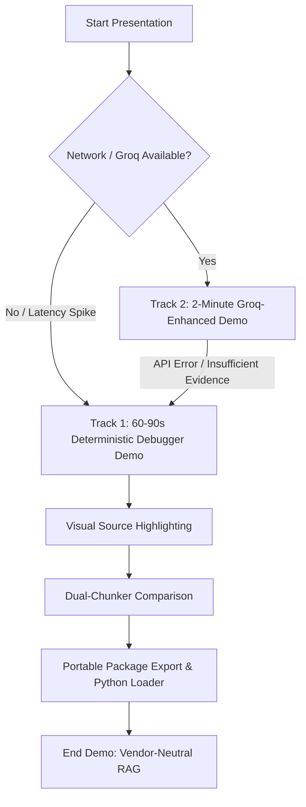

# Release Candidate, Rehearsal, and Verification Runbook

## 1. Release Objective & Acceptance Gate

**Outcome:** A tagged, reproducible release candidate ready for live presentation and offline demonstration.

**Acceptance Gate:**
1. Complete demo rehearsal passes five consecutive times without defects.
2. Release artifacts rebuild deterministically from tagged source using one command (`bash scripts/validate-release.sh`).
3. The sample portable ZIP package passes schema, referential integrity, and SHA-256 checksum validation.
4. Git tag (`v0.1.0-rc1`) and rollback point exist before final demonstration.
5. Strict zero-P1/P2 policy enforced during feature freeze.

---

## 2. Release Preparation Schedule

| Time / Phase | Focus | State Transition & Output | Acceptance Gate |
|---|---|---|---|
| **Phase 1: Feature Freeze & Clean Baseline (09:00 - 10:30)** | Code freeze, clean virtualenv & node_modules install, baseline regression test. | Clean build passing on local fixture and test suites. | All 39 backend tests and 60 frontend tests pass. No new feature branches. |
| **Phase 2: Release Packaging & Verification (10:30 - 12:30)** | Build production bundle, generate sample export ZIP, verify referential integrity and SHA256 sums. | `dist/release/webrag-sample-rc1.zip` and `dist/SHA256SUMS.txt` created. | `python3 scripts/validate-package.py` returns 100% valid with 0 errors. |
| **Phase 3: Demo Rehearsals (13:30 - 15:30)** | 5x rehearsal of 60-90s deterministic demo, 5x rehearsal of 2-min Groq demo, 2x 4-5 min technical walkthrough. | Smooth presentation timing, muscle memory, zero UI stumbles. | 5 consecutive clean runs across both tracks. |
| **Phase 4: Contingency Buffer & Video Capture (15:30 - 17:00)** | Record backup screen video, pre-cache demo answer for explanation fallback, fix P0 blockers only. | Offline MP4/WebP recording saved in repo; fallback response verified. | Video verified readable at 1080p; backup path tested with WiFi disconnected. |
| **Phase 5: Release Tagging & Final Sign-Off (17:00 - 18:00)** | Tag `v0.1.0-rc1`, compile release notes, update documentation and final checklist. | Tagged Git release with release notes. | Final sign-off against release candidate acceptance criteria. |

---

## 3. Demo Tracks & Fallback Architecture



### Track 1: 60-90s Deterministic Debugger Demo (Offline Guaranteed)
1. Open `fixtures/demo-fixture.html` and WebRAG Studio side panel.
2. Click **Capture Element** on the Authentication section.
3. Review semantic blocks: point out table, code snippet, callout, and excluded noise.
4. Compare **Recursive** vs **Heading-Aware** chunking strategies.
5. Execute query: `How long is a token valid?`
6. Click rank #1 result; show instant DOM highlight on source document.
7. Export ZIP package and execute `python3 -c "from service.packager.loader import RAGPackage; print(RAGPackage.open('webrag-sample.zip').validate().valid)"`.

### Track 2: 2-Minute Groq-Enhanced Demo (Grounded RAG)
1. Perform steps 1-5 from Track 1.
2. Click **Generate Answer** with Groq Llama 3.3 70B.
3. Show streaming response with inline `[1]` citation.
4. Click `[1]` citation; jump directly to source block.
5. Ask adversarial unanswerable question (`What is the admin OAuth client secret?`).
6. Show structured fallback: **Insufficient Evidence** flag raised, zero hallucination.

---

## 4. Release Checklist Commands

```bash
# Run complete verification suite
bash scripts/validate-release.sh

# Run standalone package validator
python3 scripts/validate-package.py dist/release/webrag-sample-rc1.zip

# Check retrieval benchmarks
npm run benchmark:retrieval
```
